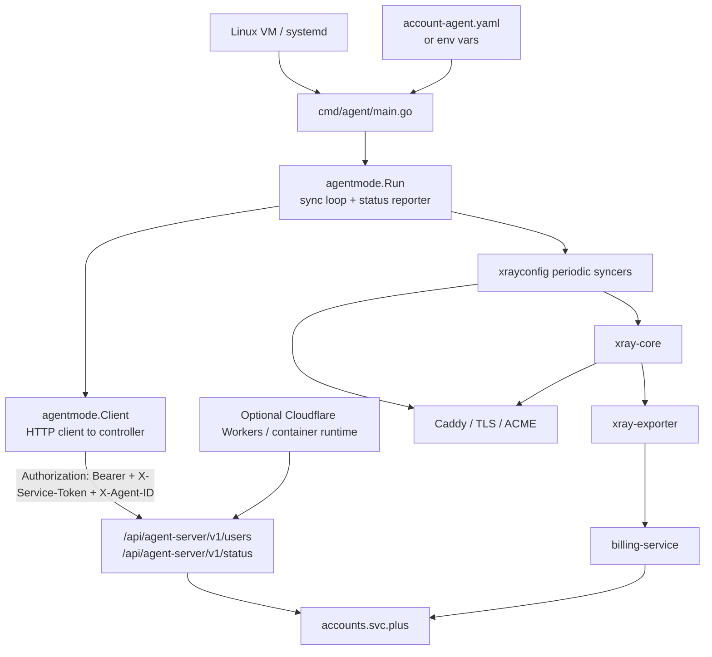

# agent.svc.plus Proxy / Runtime Architecture

## Scope

`agent.svc.plus` is the lightweight runtime control service that runs on a VM. It is not a traditional data service; it synchronizes Xray configuration, reports heartbeat/status, schedules reconciliation jobs, and bridges the node to `accounts.svc.plus`.

## Architecture

## API Matrix

| Name | Path | Purpose | Database / table | Auth mode |
| --- | --- | --- | --- | --- |
| List clients | `GET /api/agent-server/v1/users` | Fetch current Xray client list from controller | N/A | `Authorization: Bearer <agent token>` and `X-Service-Token`; optional `X-Agent-ID` |
| Report status | `POST /api/agent-server/v1/status` | Report heartbeat, health, and sync revision | N/A | `Authorization: Bearer <agent token>` and `X-Service-Token`; optional `X-Agent-ID` |
| Health | `GET /healthz` | Edge / worker health endpoint when deployed with the optional worker layer | N/A | none |

## Runtime Responsibilities

- Load `account-agent.yaml` or environment variables.
- Build and reload Xray configuration files.
- Keep TLS certificates live via Caddy.
- Poll accounts for client and node updates.
- Report agent health and sync progress back to the controller.
- Schedule billing reconciliation and future control actions without owning the billing source of truth.
- Leave traffic metric translation to the separate exporter layer.

## Data / Storage Notes

- `agent.svc.plus` does not own a persistent application database in the core runtime path.
- Any persistence is externalized to the controller-side `accounts.svc.plus` tables, especially `agents`, `nodes`, and `users`.

## Notes

- The agent runtime supports a standalone mode, but the architecture above reflects the controller-managed mode used in the main Cloud-Neutral Toolkit flow.
- The optional edge deployment exposes the same agent-server endpoints without changing the controller contract.
